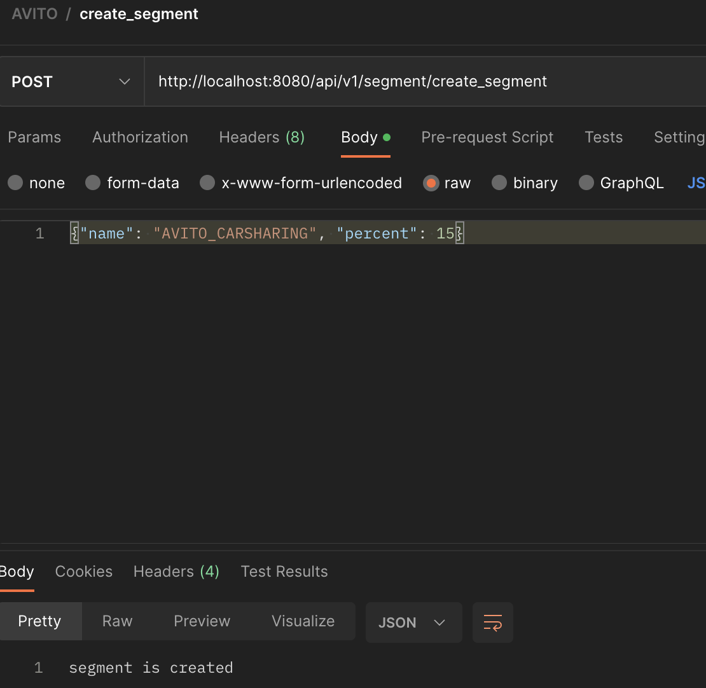
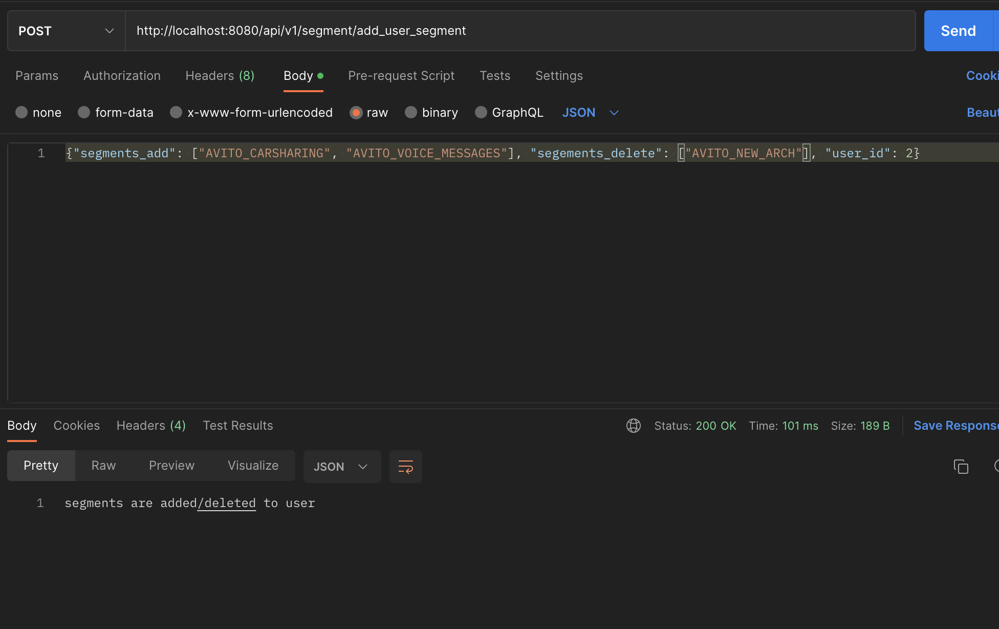
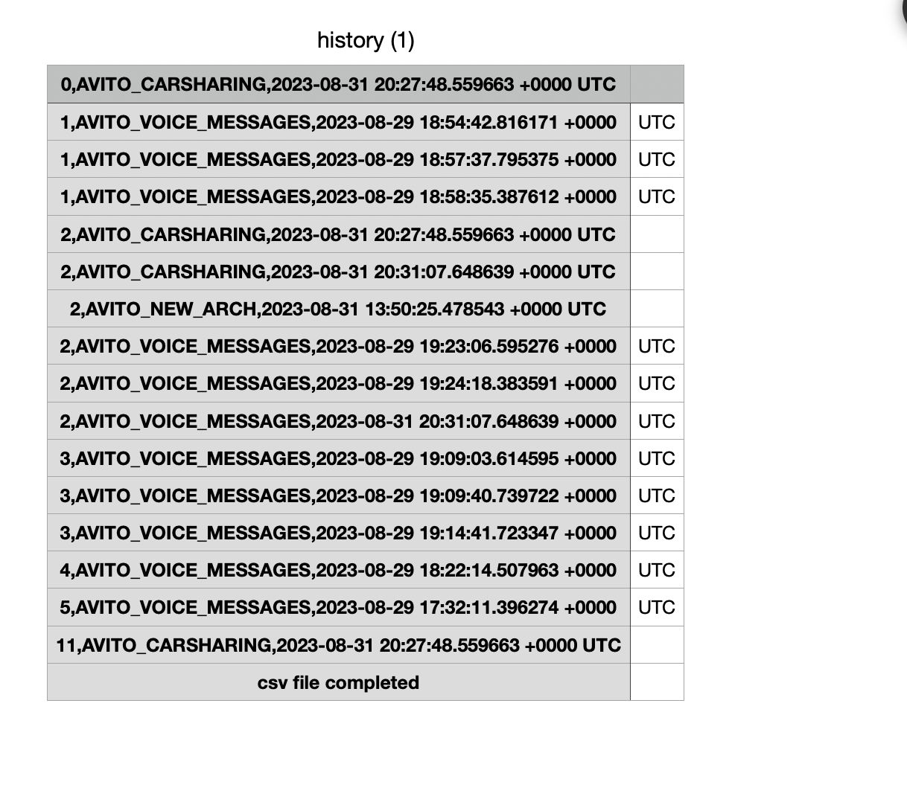
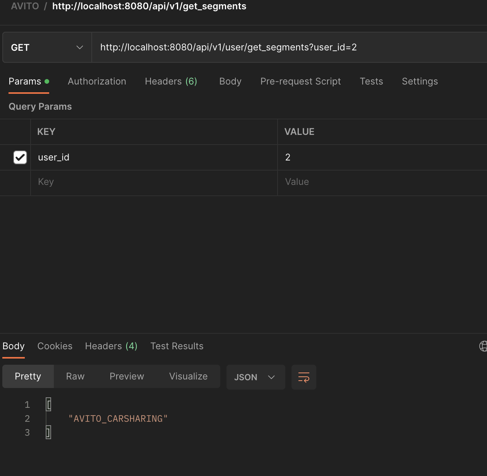
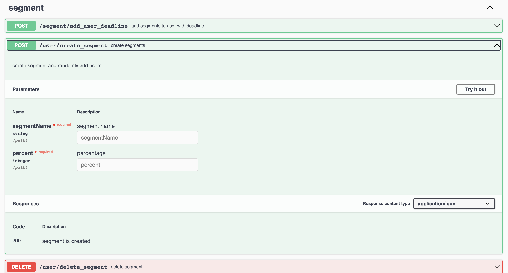

# Avito Internship 2023

Сервис динамического сегментирования пользователей


### Проблема:

В Авито часто проводятся различные эксперименты — тесты новых продуктов, тесты интерфейса, скидочные и многие другие. На архитектурном комитете приняли решение централизовать работу с проводимыми экспериментами и вынести этот функционал в отдельный сервис.

### Задача:

Требуется реализовать сервис, хранящий пользователя и сегменты, в которых он состоит (создание, изменение, удаление сегментов, а также добавление и удаление пользователей в сегмент)

## Как запустить сервис?

1. Клонируем репозиторий:
```
git clone https://github.com/Solblnc/avito_internship.git
```
2. Билдим и поднимаем контейнеры в docker-compose (app + postgreSQL containers):

### Команды

Сбилдить и поднять контейнеры:

```
make up
```

Завершить работу сервиса:

```
make down
```


Ниже предоставлена информация по основным эндпоинтам, а также несколько примеров взаимодействия с API.

## Детали реализации:
 1. Реализованы все основные методы + дополнительные методы + сваггер документация (2 доп. метод можно было реализовать через шедулер pg_cron, но успел только реализовать идею с каналами)
 2. База Данных - postgreSQL, посмотрел все выступления авито, советовали использовать pgx - https://github.com/jackc/pgx
 3. Сервер - https://github.com/gorilla/mux
 4. Сваггер - https://github.com/swaggo/swag


## Эндпоинты
### Пользователи:
* POST /api/v1/user/create_user - Создание пользователя
* GET /api/v1/user/get_segments{id} - Получение сегментов по userId


### Сегменты:
* POST /api/v1/segment/create_segment - Создание сегмента (вторым аргументом задаем процент пользователей)
* DELETE /api/v1/segment/delete_segment - Удаление сегмента по имени
* DELETE /api/v1/segment/get_history - csv файл с историей операций
* DELETE /api/v1/segment/add_user_segment - Добавить/удалить сегменты пользователю
* DELETE /api/v1/segment/add_user_deadline - Добавить сегмент с дедлайном

### Примеры ответов API:
Использовал Postman.

/api/v1/segment/create_segment - Создание сегмента:



/api/v1/segment/delete_segment - Удаление сегмента по имени


/api/v1/segment/add_user_segment - Добавить/удалить сегменты пользователю



/api/v1/segment/get_history - csv файл с историей операций



/api/v1/user/get_segments{id} - Получение сегментов по userId



## Swagger-Documentation
При запуске проекта - http://localhost:8080/swagger/index.html#/

Пример:




##  Вопросы

1. 2 доп.задание было challenging, хотелось понять, как все-таки лучше реализовать механизм "подписки".
2. Все-таки реализовал механизм миграции, так удобнее)

## To upgrade:

1. Конечно, тестирование (не хватило времени, must to do)
2. CI/CD
3. Обработка ошибок + обработчик
